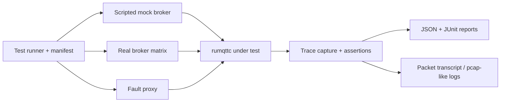

# MQTT Client Conformance Testing for rumqttc

## Executive summary

The short answer is **no**: I did not find a modern, comprehensive, MQTT **client** conformance suite for base MQTT that is clearly analogous to LabOverWire’s broker-focused `mqtt5-conformance` in breadth, structure, and reporting. The closest open-source artifacts are the Eclipse Paho testing utilities and Eclipse IoT-Testware, but they stop short of a LabOverWire-style MQTT 5 client suite with: a full normative statement manifest, broad negative-path server-to-client packet testing, capability-gated execution, dual mock/real execution modes, and machine-readable conformance reports. The official standards bodies provide the normative baseline and conformance clauses, but not an executable client TCK for base MQTT. citeturn4view0turn5view0turn25view0turn7search0turn34view0turn38search8turn39search11turn24search0

LabOverWire’s suite is strong precisely because it treats conformance as a **spec-traceable product artifact**: 183 tests, 247 tracked normative statements, section-by-section organization, a raw TCP packet builder for malformed traffic, capability-based skipping, in-process and external execution modes, and JSON reporting for CI. That architecture is directly portable in spirit to client testing, but the client analogue must invert the failure model: instead of verifying that a broker rejects malformed client packets, it must verify that a client correctly **sends**, **retries**, **parses**, **bounds**, and **recovers from** both valid and adversarial broker behavior. citeturn4view0turn38search8

The practical conclusion for a `rumqttc` fork is therefore not “adopt an existing authoritative client suite,” but “assemble one.” The most credible path is a **Rust-native conformance harness** with three layers: a scripted mock broker for deterministic protocol scenarios, a network-fault layer for latency/half-close/reset/blackhole behavior, and a real-broker interoperability matrix to catch ecosystem mismatches. Existing tools are useful building blocks, but none of them is the missing comprehensive suite by itself. citeturn27view0turn44view0turn45view0turn45view1turn44view1

## What LabOverWire demonstrates and what a client suite should emulate

LabOverWire’s `mqtt5-conformance` is broker-centric, but its architectural choices are exactly the right template for client conformance. It organizes tests by MQTT v5 specification sections; ships a high-level test client plus a raw byte-level client for malformed traffic; allows capability-driven skips; runs either in-process or against external systems under test; and emits JSON reports for CI and cross-vendor comparison. Its modules cover CONNECT/CONNACK, PUBLISH basics and properties, topic alias, flow control, QoS acknowledgments, SUBSCRIBE/UNSUBSCRIBE, PINGREQ/PINGRESP, DISCONNECT, shared subscriptions, enhanced authentication, error handling, and WebSocket transport. citeturn4view0

For a client suite, each of those broker-side ideas has a direct mirror image. The core shift is that the **system under test becomes the client**, so the harness must act as broker, network, and oracle.

| LabOverWire pattern | What it does for brokers | What to emulate for clients | Why it matters for `rumqttc` |
|---|---|---|---|
| Spec-organized modules + normative IDs | Ties tests to MQTT sections and concrete MUST/SHALL statements. citeturn4view0turn38search8 | Create a client manifest keyed to MQTT 3.1.1 and 5.0 clauses, with per-statement pass/fail/skip. | Prevents “integration tests only” drift; gives you a real conformance story. |
| High-level test client + raw packet path | Separates ordinary happy-path verification from malformed/edge-case protocol traffic. citeturn4view0 | Keep a high-level broker DSL for normal flows and a raw server-packet emitter for malformed CONNACK/PUBLISH/SUBACK/DISCONNECT/AUTH frames. | Client correctness is dominated by inbound parsing and state-machine robustness. |
| Capability gating | Skips tests when the SUT lacks a feature or transport. citeturn4view0 | Gate by protocol version, TLS, WebSocket, auth method, shared-sub support, topic alias, receive maximum, and persistence mode. | Lets one suite cover multiple `rumqttc` configurations cleanly. |
| In-process + external modes | Supports direct library testing and cross-broker execution. citeturn4view0 | Run against a mock broker in-process for determinism, then replay a selected matrix against real brokers. | You need both determinism and ecosystem realism. |
| JSON reports | Makes CI and vendor comparison straightforward. citeturn4view0 | Emit JSON plus JUnit, packet traces, and scenario transcripts. | Useful for regressions, release gates, and external bug reports. |

The **test behaviors to emulate** for clients should be the client-side inverse of LabOverWire’s broker coverage:

| Client behavior to verify | Concrete scenarios |
|---|---|
| CONNECT / CONNACK correctness | Correct CONNECT flags, clean start / session expiry encoding, auth fields, keepalive, will fields, username/password encoding, client-id corner cases, handling of CONNACK reason codes and session-present semantics. The MQTT 5 conformance clause makes packet-format correctness and MUST-level behavior across chapters 1–4 and 6 part of client conformance. citeturn38search8turn39search11 |
| Session state | Reconnect with/without prior session, inflight replay, subscription restoration policy, queued outbound QoS handling, session expiry transitions. The Paho MQTT 5 client tests explicitly exercise offline queueing and redelivery on reconnect. citeturn6view0 |
| QoS 0 / 1 / 2 | Correct packet identifiers, DUP semantics on retry, PUBACK/PUBREC/PUBREL/PUBCOMP sequencing, timeout/retry behavior, duplicate suppression. LabOverWire dedicates separate modules to QoS acks and delivery guarantees. citeturn4view0 |
| PUB/SUB flows | Subscribe options, SUBACK handling, unsubscribe handling, overlapping subscriptions, wildcard behavior, shared subscriptions if supported. Paho’s tests cover overlapping subscriptions, subscribe failure, and MQTT 5 subscribe options. citeturn6view0turn12view0 |
| Retained messages and will messages | Will properties, will delay, retain handling on subscribe, retained flag semantics, retained message delivery on reconnect. Both LabOverWire and Paho treat these as first-class behaviors. citeturn4view0turn6view0 |
| Authentication and MQTT 5 properties | AUTH exchange, reason strings, user properties, topic alias, maximum packet size, receive maximum, request/response information, response topic, correlation data. LabOverWire has dedicated enhanced-auth, publish-properties, alias, and flow-control modules; MQTT.js exposes many MQTT 5 properties and hooks, but not as a conformance suite. citeturn4view0turn12view0 |
| Error handling | Malformed broker packets, invalid property combinations, illegal packet ordering, unexpected packet identifiers, oversized packets, protocol downgrade/upgrade mismatches, malformed UTF-8, server DISCONNECT reason-code handling. LabOverWire has dedicated error-handling coverage; Mosquitto’s own tests show the importance of MQTT 5 malformed-packet edge cases. citeturn4view0turn46view1 |
| Reconnection and keepalive | Timer accuracy, missed PINGRESP, half-open detection, backoff policy, resubscribe policy, session continuity. Paho explicitly includes keepalive and reconnection/redelivery tests, and HiveMQ’s guidance emphasizes isolated broker-per-test automation for these scenarios. citeturn6view0turn27view0 |
| Flow control and ordering | Receive Maximum enforcement, packet ordering under concurrency, backpressure, large payload streaming, QoS callback ordering, fairness under multiple inflight publishes. LabOverWire has dedicated flow-control modules. citeturn4view0 |
| Large payloads and edge cases | 0-byte payloads, boundary remaining-length encodings, long topics, oversized packets, invalid UTF-8, duplicate properties, packet fragmentation across reads. Mosquitto’s regression tests demonstrate why edge-case packet sizing belongs in a serious suite. citeturn46view1 |

## Survey of existing client-focused suites, tools, and testbeds

The ecosystem is fragmented. There are useful testbeds, fuzz/fault tools, integration harnesses, and some formalized suites, but the reviewed materials do **not** show a single open-source base-MQTT client suite that combines MQTT 5 breadth, formal clause mapping, adversarial packet generation, transport-fault testing, capability gating, and CI-grade reporting in one place. The closest formal base-MQTT effort is Eclipse IoT-Testware, but its published MQTT material is tied to MQTT 3.1.1-era TTCN-3 work. The closest pragmatic open-source client artifact is the Paho testing repo, which includes MQTT 5 scripts and a test broker, but it does not present a LabOverWire-like coverage manifest or report model. citeturn7search5turn5view0turn25view0turn7search0turn34view0turn4view0

### Comparison table

| Tool / project | Type | Purpose | Versions documented | Automation hooks | CI integration | Language / platform | License | Links / sources |
|---|---|---|---|---|---|---|---|---|
| Paho Testing Utilities | Open-source test utilities | Python test broker, simple test client, network proxy, packet serializers, load / connection-loss tests; can run client tests with `client_test.py` and `client_test5.py`. Paho’s MQTT 5 client tests cover basic connect/publish/subscribe, retained messages, wills, zero-length client IDs, offline queueing, overlapping subscriptions, keepalive, reconnect redelivery, subscribe failure, and `$` topic behavior. | MQTT 3.1.1 and 5.0. Official project page still frames the initiative around MQTT 3.1.1, while the repo now includes MQTT 5 scripts. | `startbroker.py`, `client_test.py`, `client_test5.py`, scriptable Python execution. | Practical and script-friendly; no LabOverWire-style JSON conformance report is documented. | Python | EPL-2.0 + EDL-1.0 | Repo / docs citeturn5view0turn25view0turn26view0turn8view0turn6view0 |
| Eclipse IoT-Testware MQTT suite | Open-source formal conformance suite | TTCN-3 abstract test suite for MQTT with four test configurations, including **client as implementation under test** and broker as test system. Uses test purposes and TTCN-3 cases mapped to spec references. | Published docs align to MQTT 3.1.1-era materials; the docs reference an annotated official MQTT spec and do not show MQTT 5 coverage in the reviewed pages. | PICS / PIXIT style configuration, TTCN-3 execution on Eclipse Titan. | Automation is possible but heavier than typical library CI. | TTCN-3 / Titan | EPL-1.0 | Repo / docs citeturn33view0turn34view0turn7search7 |
| MQTT.js repository tests | Open-source library test suite | Regression tests for the JavaScript client library, with Node and browser test execution. The repo documents MQTT 5 properties, topic alias, custom ACK handling, reconnect behavior, and browser/node support, but not as a formal conformance program. | MQTT 3.1, 3.1.1, and 5.0 support are documented. | `npm test`, Node tests, browser tests via Web Test Runner, CLI tools for pub/sub. | Clear CI-oriented test scripts and coverage badges are present. | TypeScript / JavaScript, Node and browser | MIT | Repo / scripts citeturn10view0turn11view0turn12view0turn14view1 |
| HiveMQ MQTT CLI | Open-source diagnostic client tool | Feature-rich CLI for interactive publish/subscribe, multiple client contexts, and “quick broker tests.” Useful for smoke tests and scripting, not a normative client TCK. | MQTT 3.1.1 and 5.0. | Shell mode, direct mode, `mqtt test`, multi-client contexts. | Easy to embed in shell CI. | Java CLI | Apache-2.0 | Docs / repo citeturn28view0turn29view0turn15search12 |
| HiveMQ Testcontainers module / HiveMQ Testcontainer | Open-source integration testbed | Starts isolated HiveMQ containers per test for MQTT client application testing and extension testing; recommended by HiveMQ for automated client-app tests. | Via HiveMQ broker support, MQTT 3.x and 5.0. | JUnit 4/5 integration, container lifecycle, configurable broker image and extensions. | Explicitly intended for repeatable integration tests in CI. | Java / Testcontainers | Apache-2.0 | Docs / repo / blog citeturn31search0turn48search0turn48search1turn48search2turn48search9turn27view0 |
| HiveMQ Swarm | Commercial load/reliability testbed | Distributed simulation of large MQTT populations for scalability, reliability, and scenario testing; useful for client-behavior-at-scale, not normative correctness. | The reviewed docs do not publish a packet-level conformance matrix by protocol version. | XML scenarios, distributed agents, reports, dashboards, Docker support. | Docs explicitly mention continuous-development-pipeline integration. | Distributed Java-based platform | Commercial, trial-limited | Docs / product page citeturn30view1turn30view0turn30view3 |
| Mosquitto utilities + internal test harness | Open-source utilities and broker regression tests | `mosquitto_pub` and `mosquitto_sub` are simple MQTT clients for smoke testing; the Mosquitto repo also contains Python packet/harness tests such as MQTT 5 options helpers and malformed/edge-case broker tests. Useful as building blocks, not a client conformance suite. | Utilities support MQTT 5 / 3.1.1; broker supports 5.0 / 3.1.1 / 3.1. | CLI tools and Python packet tests. | Scriptable; internal harness exists, but no standalone client conformance program is documented. | C utilities + Python tests | EPL / EDL | Man pages / repo / tests citeturn18search1turn18search4turn18search6turn46view0turn46view1 |
| VerneMQ `vmq_mzbench` | Open-source load/usage scenario tool | Scenario-driven MQTT load testing for VerneMQ and other systems. Good for usage simulation and scale, not normative client conformance. | Current reviewed docs do not clearly publish an MQTT protocol-version matrix for the tool. | Scenario files for MZBench, distributed workers. | Scriptable, but not presented as CI-first or normative. | Erlang / MZBench | Apache-2.0 | Docs / repo citeturn17search0turn17search2turn49view0 |
| OASIS / ISO MQTT specifications | Official normative baseline | MQTT 5 and MQTT 3.1.1 standards define conformance clauses for clients and servers and enumerate the MUST-level behavior a conforming client must follow. They are the essential source of truth, but not an executable suite. | MQTT 3.1.1 and 5.0. | None by themselves. | None by themselves. | Standards documents | Standards publication terms | Specs / catalog citeturn38search8turn39search11turn24search0 |
| Eclipse Sparkplug TCK | Open-source profile-specific TCK | Real TCK, but for the Sparkplug profile **on top of MQTT**, not for base MQTT protocol conformance. Requires a HiveMQ instance and TCK web console. | Sparkplug 3.0 over MQTT; useful for MQTT-based stateful profiles, not raw base-MQTT client semantics. | HiveMQ extension + Node/yarn web console. | Usable in automation, but more product-profile-specific than base protocol. | Java / Node / HiveMQ extension | EPL-2.0 | User guide / project FAQ citeturn42search0turn50search0turn50search3turn50search7 |
| `pytest-mqtt` | Community project | Pytest fixtures for MQTT applications, including captured messages and a Mosquitto broker fixture. Useful for application testing, not protocol conformance. | README does not publish a formal MQTT version matrix; uses the Paho Python client and Mosquitto fixture. | Pytest fixtures, CLI args for broker host/port/user/password. | GitHub Actions and coverage badges are published. | Python / pytest | MIT | README / license citeturn43view0turn43view1 |
| Toxiproxy | Community network-fault testbed | Deterministic TCP fault injection for latency, bandwidth limits, slow close, timeout, reset, and other failure modes. Excellent adjunct for MQTT client resilience tests; not MQTT-specific. | Protocol-agnostic TCP. | HTTP API, CLI, multiple client libraries including Rust. | Explicitly designed for testing, CI, and development. | Go server + multi-language clients | MIT | Repo citeturn44view0 |

### Condensed coverage matrix

**Legend:** H = substantial documented coverage, M = partial or indirect coverage, L = minimal, — = not the tool’s purpose.

| Tool | Connect / session | QoS / ack flow | Pub/Sub / retain | Will / keepalive / reconnect | MQTT 5 properties / auth | Negative / fault injection | Formal spec mapping |
|---|---:|---:|---:|---:|---:|---:|---:|
| Paho Testing Utilities | H | H | H | H | M | M | L |
| Eclipse IoT-Testware | H | H | H | M | L | M | H |
| MQTT.js repo tests | M | M | M | M | M | L | — |
| HiveMQ MQTT CLI | M | L | M | L | M | L | — |
| HiveMQ Testcontainers | M | M | M | M | L | L | — |
| HiveMQ Swarm | M | M | M | H | L | M | — |
| Mosquitto utilities / tests | M | M | M | L | M | H for broker regressions, L for clients | — |
| VerneMQ `vmq_mzbench` | M | M | M | H | L | M | — |
| Sparkplug TCK | M | M | H for Sparkplug semantics | H | M | L | H for Sparkplug, not base MQTT |
| `pytest-mqtt` | L | L | M | L | L | L | — |
| Toxiproxy | — | — | — | H | — | H | — |

This matrix is the core reason the answer is “no comprehensive analogue exists”: the reviewed artifacts tend to be either **formal but dated and MQTT 3.1.1-centric**, or **pragmatic and useful but incomplete / non-normative / app-level**. citeturn33view0turn34view0turn25view0turn6view0turn10view0turn27view0turn30view1turn46view1turn44view0

## Gap analysis against LabOverWire-style broker coverage

Relative to LabOverWire’s broker suite, the biggest missing area on the client side is **adversarial inbound broker behavior**. LabOverWire’s broker tests lean heavily on raw malformed client packets and broker rejection logic. The client analogue would need the inverse: malformed CONNACK, malformed properties, contradictory reason codes, illegal packet ordering, bogus packet identifiers, invalid UTF-8 strings arriving from the broker, oversized payloads relative to negotiated limits, and state-machine violations after reconnect. None of the reviewed general-purpose client-facing tools publishes that as a comprehensive MQTT 5 suite. citeturn4view0turn25view0turn34view0turn10view0turn27view0turn46view1

The second large gap is **MQTT 5 negotiated behavior as client obligations**. The spec makes conformance depend on client packet-format correctness and all client-applicable MUST-level requirements across MQTT packet format, control packets, operational behavior, and WebSocket transport. But the reviewed tooling rarely exposes a matrix for: Receive Maximum enforcement, Maximum Packet Size negotiation, server-assigned topic alias handling, Request/Response Information interactions, AUTH loops, server DISCONNECT reason handling, and property-validation corner cases. Paho and MQTT.js expose pieces of this; LabOverWire systematically covers the mirror-image broker side. citeturn38search8turn12view0turn4view0

The third gap is **recovery correctness, not just recovery existence**. Existing testbeds can prove that a client reconnects, but they usually do not prove the exact semantic aftermath: whether DUP is set correctly, whether QoS 2 resumes at the right stage, whether callbacks are ordered correctly, whether resubscription is policy-correct, or whether replay after session resume obeys packet-order constraints. Paho has useful reconnect/redelivery coverage, but not a complete normative manifest; load tools like Swarm and `vmq_mzbench` stress systems, but they are not clause-driven client conformance suites. citeturn6view0turn30view1turn17search0

The fourth gap is **transport-fault determinism**. Real client robustness depends on behavior under half-close, blackhole, delayed ACK-like reads, bandwidth throttling, delayed PINGRESP, reset after CONNACK, and fragmented packets split across reads. The MQTT-specific tools surveyed only partially address this. By contrast, Toxiproxy is purpose-built for deterministic failure simulation, which is why a serious client suite should treat network chaos as a first-class layer rather than an afterthought. citeturn44view0turn27view0

A practical porting rule is therefore:

| LabOverWire broker area | Client equivalent you should build | Priority |
|---|---|---|
| CONNECT / CONNACK modules | CONNECT encoding correctness, CONNACK parsing, session-present semantics, negative reason codes | P0 |
| PUBLISH / QoS / flow-control modules | Outbound QoS sequencing, inbound QoS parser/state machine, receive-maximum and duplicate handling | P0 |
| SUBSCRIBE / UNSUBSCRIBE modules | SUBSCRIBE option encoding, SUBACK / UNSUBACK parsing, overlapping and wildcard semantics | P0 |
| Error-handling module | Malformed inbound packets, invalid properties, illegal packet ordering, server DISCONNECT behavior | P0 |
| Publish-properties / alias / enhanced-auth modules | MQTT 5 properties, alias negotiation, AUTH state machine | P1 |
| Ping / disconnect / reconnect areas | Keepalive timers, reconnect semantics, will outcomes, clean-start/session-expiry combinations | P1 |
| WebSocket module | WebSocket transport parity and close-code handling if your fork supports WS | P2 |
| Broker-only lifecycle hooks / ACL tests | Usually **not** direct client-conformance targets; move to interoperability/system tests instead | P3 |

## A practical design for a `rumqttc` client conformance suite

The highest-leverage design is a **three-layer harness**:



The **scripted mock broker** is the core. It should speak raw MQTT over TCP and, optionally, WebSocket/TLS later. Its purpose is not performance; its purpose is to deterministically emit exact packet sequences, timing, malformed fields, and failures. The **real-broker matrix** is a secondary validation layer for interoperability against Mosquitto, HiveMQ CE, and any other brokers you care about. The **fault proxy** sits between either broker path and `rumqttc` to inject latency, timeout, half-close, reset, bandwidth limits, and fragmented writes. Existing infrastructure already exists for the outer layers: Testcontainers for Rust, the community Mosquitto module for Rust tests, and Toxiproxy or the Rust-native `noxious` port. citeturn45view0turn45view1turn45view2turn44view0turn44view1

The suite should be organized exactly like a conformance product, not like a pile of integration tests:

| Suite component | Recommendation |
|---|---|
| Manifest | TOML or YAML manifest keyed to OASIS clause IDs, version, transport, feature dependencies, and expected behavior class. |
| Scenario model | `ScriptedBrokerScenario { preconditions, broker_steps, assertions, requirements }`. |
| Packet layer | One raw encoder/decoder for broker packets; one transcript layer for deterministic assertions. |
| Test backends | `mock_broker`, `real_broker`, `fault_proxy(mock)`, `fault_proxy(real)`. |
| Reports | JSON for machine processing, JUnit for CI, human-readable markdown / HTML summary. |
| Skip model | Capability-gated skips for protocol version, transport, persistence mode, MQTT 5 features, auth features. |
| Oracles | Assert on packets sent by the client, event-loop behavior, callback order, timers, retransmit flags, and panic-free execution. |

A **minimal initial corpus** should prioritize breadth across the most error-prone requirements:

| Priority | Test families |
|---|---|
| P0 | CONNECT/CONNACK; session-present and clean-start/session-expiry; QoS 0/1/2 happy-path and error-path; SUBSCRIBE/SUBACK and UNSUBSCRIBE/UNSUBACK; malformed incoming packet handling; duplicate packet-id handling; keepalive timeout and reconnect behavior. |
| P1 | MQTT 5 property negotiation; Receive Maximum; Maximum Packet Size; Topic Alias; user properties; reason strings; DISCONNECT behaviors and reason-code handling; large payload and boundary-length cases. |
| P2 | AUTH exchanges; WebSocket parity; TLS renegotiation / cert failure behavior; out-of-order or duplicated inbound acks. |
| P3 | Long-run soak tests, fairness under concurrency, broker matrix expansion, fuzzing, and differential testing against reference clients. |

### Example scenarios

A useful first batch for `rumqttc` would be:

1. **CONNACK error mapping**: broker returns `Not authorized`, `Bad user name or password`, `Unsupported protocol version`, `Quota exceeded`; verify surfaced error type and reconnect policy.
2. **Session-present semantics**: reconnect same client ID with persistent session; verify no duplicate subscribe if session is present and policy says “resume.”
3. **QoS 1 replay after connection drop**: send publish, drop connection before PUBACK, reconnect with prior session, assert retransmitted PUBLISH with DUP=1.
4. **QoS 2 mid-flight resume**: drop after PUBREC, ensure resumed path is PUBREL, not full-message replay.
5. **Inbound malformed properties**: duplicate non-repeatable property in CONNACK or PUBLISH; verify disconnect/error, not silent acceptance.
6. **Negotiated max packet size**: broker advertises smaller maximum; verify client limits outbound publishes and reports a local error rather than sending an oversized packet.
7. **Receive Maximum**: broker sets low inbound window; verify outstanding QoS 1/2 publications never exceed it.
8. **Keepalive blackhole**: suppress PINGRESP via proxy; verify timeout detection and reconnect behavior.
9. **Server DISCONNECT with reason and properties**: verify exact event/error mapping.
10. **Fragmented packet reads**: split CONNACK and PUBLISH across many tiny TCP reads; verify parser correctness and no deadlock.
11. **Large payload boundaries**: 127/128-byte remaining-length transitions; near-maximum topic lengths; zero-byte payloads.
12. **Out-of-order ack injection**: PUBCOMP without prior PUBREL, SUBACK with unknown packet id, or ACK for an old inflight ID; verify correct rejection behavior.

### Minimal Rust-oriented harness sketch

The following is **pseudo-code with Rust structure**, intended to show how to shape the suite.

```rust
use std::{future::Future, sync::Arc, time::Duration};
use tokio::{
    io::{AsyncReadExt, AsyncWriteExt},
    net::{TcpListener, TcpStream},
    time::sleep,
};

type Check = Arc<dyn Fn(&[u8]) -> anyhow::Result<()> + Send + Sync>;

#[derive(Clone)]
enum BrokerStep {
    Expect(Check),        // assert client sent a packet matching predicate
    Send(Vec<u8>),        // send exact broker packet bytes
    Pause(Duration),      // timing-sensitive scenarios
    Close,                // hard close socket
}

async fn run_scripted_broker(steps: Vec<BrokerStep>) -> anyhow::Result<u16> {
    let listener = TcpListener::bind("127.0.0.1:0").await?;
    let port = listener.local_addr()?.port();

    tokio::spawn(async move {
        let (mut sock, _) = listener.accept().await.expect("accept failed");
        let mut buf = vec![0u8; 8192];

        for step in steps {
            match step {
                BrokerStep::Expect(check) => {
                    let n = sock.read(&mut buf).await.expect("read failed");
                    (check)(&buf[..n]).expect("client packet assertion failed");
                }
                BrokerStep::Send(bytes) => {
                    sock.write_all(&bytes).await.expect("write failed");
                }
                BrokerStep::Pause(d) => sleep(d).await,
                BrokerStep::Close => {
                    let _ = sock.shutdown().await;
                    break;
                }
            }
        }
    });

    Ok(port)
}
```

One representative retransmission test can then look like this:

```rust
#[tokio::test]
async fn qos1_publish_is_replayed_with_dup_after_drop() -> anyhow::Result<()> {
    // Phase 1 broker: accept CONNECT, send CONNACK(session present = false),
    // expect a QoS1 PUBLISH, then drop connection before PUBACK.
    let port1 = run_scripted_broker(vec![
        BrokerStep::Expect(Arc::new(assert_connect("client-a"))),
        BrokerStep::Send(connack_success(false)),
        BrokerStep::Expect(Arc::new(assert_publish_qos1("t/a", b"hello", false))),
        BrokerStep::Close,
    ]).await?;

    // Start rumqttc against broker #1, publish once, observe disconnect.
    let mut client = start_rumqttc("client-a", port1, /* clean_start = */ false).await?;
    client.publish_qos1("t/a", b"hello").await?;

    // Phase 2 broker: accept reconnect, signal resumed session, and expect DUP replay.
    let port2 = run_scripted_broker(vec![
        BrokerStep::Expect(Arc::new(assert_connect("client-a"))),
        BrokerStep::Send(connack_success(true)),
        BrokerStep::Expect(Arc::new(assert_publish_qos1("t/a", b"hello", true))),
        BrokerStep::Send(puback(10)),
    ]).await?;

    client.repoint_for_test(port2).await?; // or restart eventloop with same persistence
    client.drive_until_idle().await?;

    Ok(())
}
```

For the outer layers, prefer existing Rust-friendly tooling rather than inventing everything yourself. Testcontainers for Rust makes ephemeral broker setup straightforward, and the community `testcontainers-modules` crate already ships a Mosquitto module. For fault injection, Toxiproxy is mature and has a Rust client ecosystem, while `noxious` offers a compatible Rust-native server with the same REST API. citeturn45view0turn45view1turn45view2turn44view0turn44view1

## Prioritized roadmap, tooling, and references

The recommended implementation order is:

| Order | Deliverable | Why first |
|---|---|---|
| First | **Clause manifest** for MQTT 3.1.1 and 5.0, with a first-pass mapping of client-applicable MUST/SHALL requirements. | Without a manifest, you will get “lots of tests” but not “conformance.” |
| Next | **Scripted mock broker crate** with raw broker-packet emitters and transcript assertions. | This is the missing capability in most current artifacts. |
| Then | **P0 corpus**: CONNECT/CONNACK, sessions, QoS 0/1/2, SUBACK/UNSUBACK, keepalive, malformed inbound packets. | Highest defect density; highest release value. |
| Then | **Rust CI integration** using Testcontainers + Mosquitto module + JUnit/JSON artifacts. | Makes the suite part of everyday development instead of a side project. |
| Then | **Fault layer** via Toxiproxy or `noxious`. | Required to test reconnect correctness under deterministic network failure. |
| Then | **Real-broker matrix** with Mosquitto, HiveMQ CE, and optionally VerneMQ / others. | Catches ecosystem mismatches and ambiguous corner behavior. |
| Later | **MQTT 5 deep features**: AUTH, alias, max-packet-size, receive-maximum, user-property corner cases, WebSocket parity. | High complexity, but important for real conformance claims. |
| Later | **Fuzzing / differential testing** against reference clients and parser property fuzzers. | Great for hardening after the deterministic suite exists. |

The best **seed material** for the first implementation wave is:

- The MQTT 5 and MQTT 3.1.1 specifications from entity["organization","OASIS","standards consortium"], especially the client conformance clauses and clause IDs. citeturn38search8turn39search11
- ISO/IEC 20922 for the ISO-backed MQTT 3.1.1 baseline from entity["organization","ISO","standards body"]. citeturn24search0
- LabOverWire’s test architecture and module map as the design template to invert for clients. citeturn4view0
- The Paho client test scripts as practical starting scenarios for retained messages, wills, keepalive, reconnect, offline queueing, and subscribe failures. citeturn25view0turn6view0
- The Eclipse IoT-Testware materials under the entity["organization","Eclipse Foundation","open source org"] for formal test-purpose style and client-as-IUT architecture. The work explicitly references ETSI methodology, which is useful if you want a more standards-shaped test taxonomy. citeturn34view0turn7search7
- Testcontainers for Rust and the Rust Mosquitto module for repeatable broker orchestration. citeturn45view0turn45view1turn45view2
- Toxiproxy from entity["company","Shopify","ecommerce company"] or the Rust-native `noxious` port for deterministic fault injection. citeturn44view0turn44view1

The most defensible final position for your `rumqttc` fork is therefore:

**Build a client conformance suite rather than searching for a ready-made one.** Use LabOverWire’s structure as the organizational model, use OASIS/ISO as the normative source of truth, borrow scenario ideas from Paho and IoT-Testware, and use Rust-native orchestration plus network-fault tooling to cover the client-only failure modes that today’s ecosystem largely leaves uncovered. That path gives you something the current MQTT tooling landscape still appears to lack: a serious, reportable, MQTT 5 client conformance program. citeturn4view0turn38search8turn39search11turn25view0turn34view0turn45view0turn44view0