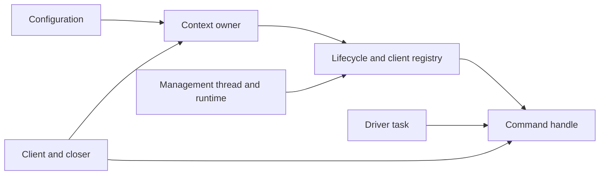

# Explicit shared execution measurements

Dedicated startup remains the default. C applications can explicitly construct
one multi-thread Tokio execution context and attach many clients. The selected
mode prioritizes many-client memory and thread savings; shared scheduling can
increase tail latency. It is not a hard latency service. No process-global
runtime, shard API, caller pump or foreign-reactor bridge is introduced.

## Ownership and architecture decision

Both placements run the same owned, `Send` driver future, protocol loops,
completion/event machinery and terminal guard. Dedicated placement owns a
current-thread runtime and driver thread. Shared placement owns one management
thread, configurable Tokio scheduler workers, and a configurable blocking pool.
Defaults are two workers, at most 32 blocking workers and capacity 1,024. Numeric
loopback addresses in the TCP matrix do not require DNS or deferred TLS workers;
other workloads can increase the measured thread count.

Capacity reservations and context lifecycle share one mutex. Accepted starts
commit before shutdown's administrative command; uncommitted starts reject
closing and return their reservation. Construction reservations prevent early
runtime teardown. Completed driver tasks release capacity only after tracked
auxiliary cleanup. Rejected blocking observations have a separate
`CompletionWaitOutcome::ObservationRejected` value: they do not complete or
cancel an operation and carry `InvalidState` without a delivery claim. Drivers
never retain the execution owner. Clients/closers and configurations do, avoiding
an intrinsic owner/task cycle.

The context has no task-to-owner reference cycle:



Shutdown requests immediate client cleanup. Drivers reconcile their active
operations and publish terminal outcomes before observers can report teardown.
Per-client join includes tracked deferred TLS work; context join additionally
waits for runtime blocking work, scheduler workers and management-thread join.
Timeout ends only observation. Untracked runtime blocking work (including DNS)
can outlive a client outcome but cannot outlive successful context join.
Management failure reconciles cancelled tasks and remains an error on repeated
joins. Final-owner release requests cleanup without blocking, so explicit join
is required to prove quiescence. Host-retained owners still require release
before code unloading, regardless of context quiescence.

Ready MQTT and control paths yield cooperatively. Synchronous host callbacks
and destructors must return promptly; native deadlines cannot preempt them.
Shared tasks can migrate between workers. Blocking waits for any native client,
completion or context are rejected in callbacks and on context workers. Polling
and asynchronous/nonblocking work remain available.

The private shard comparator uses two current-thread runtimes, assigns clients
round-robin and retains the same driver, context lifecycle and callbacks. It is
built by replacing only `Builder::new_multi_thread().worker_threads(...)` with
`Builder::new_current_thread()` in `src/execution.rs`, copying the release
libraries to a separate directory, and restoring the source. The benchmark's
`shards` label requires this separate artifact; it never selects a shard
implementation in a production library. Each private context has its own
blocking pool, so its aggregate ceiling is 64 workers versus 32 for the selected
context; numeric-loopback TCP cases do not activate either pool. No alternate
production implementation
or public shard setting remains.

## Measurement method

`execution.c` is a real dynamically linked C consumer. `execution_python.py`
uses the existing public asyncio client operations with a private execution
selection hook compiled only by Python's `benchmark-testing` feature. Standard
Python wheels do not gain a shared-execution API. All profiles are built before
measuring; each run has a fresh consumer process and fresh Mosquitto broker.
Execution order rotates across repetitions. Resource snapshots use `psutil`;
raw JSON preserves run labels, binary/library/source hashes, environment,
failures and samples.

The matrix supports both MQTT versions, 1/10/100/1,000 clients, QoS 0/1/2 and:

- `idle`: connected clients, a 200 ms resource-sampling interval, and 200 ms work;
- `publish`: one tracked 64-byte publication per client per round, all admitted
  before the round's completions are collected;
- `incoming`: all clients subscribe, one publisher broadcasts once per round,
  and all client event queues are consumed before the next round;
- `periodic`: the publish workload with 100 ms between rounds;
- `hotspot`: up to eight outstanding additional QoS 0 publications on client
  zero while all clients execute the publish workload; C uses tracked batches
  and asyncio uses eight public-publish producers. Admission samples include
  capacity retries. This bounds offered work rather than prescribing a fixed rate;
- `reconnect`: broker stop/restart followed by observing every client's next
  Connected event.

This is loopback wrapper/application observation, not isolated MQTT maximum
throughput. Sequential startup includes broker connection and subscription
work; context construction precedes that timer in all profiles. C admission
samples measure only the tracked C admission call. Completion/event samples
include round-robin host observation delay. Python public publish combines
admission and completion, so Python has no separate admission samples. Python's
5 ms asyncio probe records wake delay during measured work; workloads finishing
before its first tick can have no loop-delay samples. Reconnect timing starts
after broker restart, at the consumer barrier. Process CPU snapshots provide an idle delta and a combined work/teardown
delta; the latter also includes printing the result. They do not isolate pure MQTT
CPU cost. The 200 ms idle interval and process CPU-time resolution limit small
CPU comparisons. Allocator-retained memory after teardown is not a leak test.

Successful context join and a separate repeated-creation native test verify
thread teardown. Raw startup failures are preserved as `startup_failed` and
never treated as successful 1,000-client measurements. The runner fails for
traffic, teardown or broker errors. A startup-failed row needs its recorded
error reviewed before attributing it to a resource limit.

TCP, Rustls TLS, WS and WSS can be selected with `--transports`; Mosquitto must
support the requested listener. The transport matrix is distinct from the
resource workload, and unavailable listeners remain failures in the evidence.
The default resource comparison uses TCP. Behavioral suites cover slow consumers,
overload, manual acknowledgement, pending host callbacks and feature composition;
these are not equivalent to measuring every production traffic pattern.

## Reproduction

From the repository root, with Python 3.12+, `psutil`, CMake, a C compiler and
Mosquitto installed:

```sh
cargo build --manifest-path native-wrappers/Cargo.toml --release \
  -p rumqttc-c-next -p rumqttc-python-next \
  --features rumqttc-python-next/benchmark-testing,pyo3/extension-module
cmake -S native-wrappers/c/tests/native -B native-wrappers/target/execution-release \
  -DRUMQTTC_LIBRARY_DIR="$PWD/native-wrappers/target/release"
cmake --build native-wrappers/target/execution-release --config Release \
  --target rumqttc-native-execution-benchmark
python3 native-wrappers/wrapper-core/benches/execution_matrix.py \
  --binary native-wrappers/target/execution-release/rumqttc-native-execution-benchmark \
  --c-library native-wrappers/target/release/librumqttc.so \
  --python-library native-wrappers/target/release/librumqttc_python.so \
  --repetitions 7 --rounds 10 \
  --output native-wrappers/target/execution-measurements
```

On macOS use `.dylib`; Windows uses `Release/...exe` and `rumqttc_python.dll`.
`--shards-binary`/`--shards-python-library` add the private comparator described
above, built separately and copied before restoring/rebuilding the selected
source. The normal command compares only dedicated and selected shared mode.
Produce a portable per-run CSV without pooling percentile samples:

```sh
python3 native-wrappers/wrapper-core/benches/summarize_execution.py \
  native-wrappers/target/execution-measurements \
  native-wrappers/target/execution-measurements.csv
```

Reported percentile comparisons use medians of per-run percentiles, rather than
pooled packet percentiles. CSV retains individual-run rates, percentiles,
maximum latency, startup/teardown timings and resource snapshots.

CI runs the real C and Python workload on Linux, macOS and Windows and uploads
raw resource/latency artifacts. CI's single repetition is a smoke/measurement
artifact, not a statistically stable seven-run result. Local platform evidence
and any unexecuted platform coverage are recorded below.

## Results

The [checked-in evidence](execution-results/README.md) contains per-run CSVs,
compressed raw samples and exact environment/artifact/source hashes. Release
builds ran on an Intel Core i5-13500H with 16 logical CPUs, Linux 7.2.9
CachyOS/glibc 2.44, Rust 1.96.1, Python 3.14.7 and Mosquitto 2.1.2. No build or
other benchmark ran alongside the measurements. Both MQTT versions and every
client count started successfully in all modes.

All 1,584 full-matrix runs passed: three interleaved repetitions, three publish
rounds, both consumers, both protocols, QoS 0/1/2 and idle/publish/incoming/
periodic/reconnect workloads. The final resource/busy-client comparison has
672 passing runs with seven repetitions and three publish rounds. Rates describe
this short offered workload; they do not estimate saturation throughput.

### Resources and selection

Median idle C resident memory in MiB over seven runs:

| Clients | Protocol | Dedicated | Shared, two workers | Private two-shard comparator |
| ---: | :--- | ---: | ---: | ---: |
| 1 | 3.1.1 | 5.89 | 6.23 | 6.00 |
| 1 | 5 | 6.11 | 6.43 | 6.20 |
| 10 | 3.1.1 | 7.06 | 6.86 | 6.67 |
| 10 | 5 | 7.58 | 7.25 | 7.07 |
| 100 | 3.1.1 | 18.13 | 13.02 | 12.80 |
| 100 | 5 | 21.60 | 15.67 | 15.43 |
| 1,000 | 3.1.1 | 128.70 | 74.62 | 74.25 |
| 1,000 | 5 | 161.42 | 99.31 | 98.93 |

At 1,000 C clients, shared execution saves 42.0%/38.5% resident memory for
3.1.1/5 and reduces process threads from 1,001 to four. Median virtual memory
falls from 3,020/3,073 MiB to 229/282 MiB. The private comparator has three
threads and 163/216 MiB virtual memory; its resident-memory advantage over the
selected runtime is only about 0.4 MiB. Virtual memory includes allocator arenas,
thread stacks and mapping reservations; it does not measure stack use alone.
From 100 to 1,000 clients, incremental resident memory per additional C client
is 125.8/159.1 KiB dedicated versus 70.1/95.2 KiB shared.

The actual asyncio consumer corroborates the resource benefit: at 1,000 clients,
median resident memory falls from 154.70/187.96 MiB to 99.73/124.51 MiB and
threads from 1,019 to 22. Host interpreter/executor threads remain present.
After teardown every C idle run returns to one thread and every Python idle
run to 20 host threads. The native lifecycle fixture also repeatedly creates,
shuts down and joins contexts and verifies the original process thread count.
The 200 ms idle CPU delta has median zero in all 1,000-client profiles; timer
length and CPU accounting resolution prevent a meaningful CPU-efficiency claim.
CSV preserves combined active-work/teardown CPU deltas without attributing them
solely to MQTT work.

Select one explicitly owned multi-thread context with two default workers.
It removes the many-client thread cost while Tokio can schedule drivers across
workers without permanent client assignment. The shard comparator has a small
resource advantage and wins some latency/rate cases, but does not consistently
outperform the selected runtime. Its fixed assignment and another runtime
architecture are not justified by these results. Dedicated execution remains
the default: the shared runtime has about 0.3 MiB and two additional process
threads of overhead for a single C client, and its scheduling changes latency.
Worker and blocking-pool limits remain explicitly configurable.

### Latency, offered rates and teardown

At 1,000 C clients, median per-run completion p99 in ms, three repetitions:

| Protocol | QoS | Dedicated | Shared | Private shards |
| :--- | ---: | ---: | ---: | ---: |
| 3.1.1 | 0 | 4.20 | 4.75 | 5.96 |
| 3.1.1 | 1 | 5.47 | 7.16 | 9.45 |
| 3.1.1 | 2 | 11.07 | 13.21 | 12.83 |
| 5 | 0 | 4.87 | 5.97 | 4.84 |
| 5 | 1 | 5.58 | 8.62 | 6.89 |
| 5 | 2 | 11.80 | 16.83 | 12.19 |

The resource benefit comes with C completion-tail regressions in this workload.
At 100 clients, QoS 1 completion p99 also increases from 0.65/0.87 ms to
1.06/1.34 ms. At 1,000 clients the median observed QoS 0 completion rate falls
from 255k/221k per second to 168k/139k, while QoS 1 is 113k/106k dedicated versus
113k/100k shared, and QoS 2 is 69k/63k versus 72k/61k. These application-observed
rates include admission and sequential host collection, and are not isolated
scheduler or broker throughput. Full CSVs preserve admission and event
percentiles, rates, maximums, startup and teardown for each run.

Python's host scheduling and combined public-publish milestone differ from the
C measurement. At 1,000 clients, QoS 1 completion p99 is 40.06/39.12 ms dedicated
versus 41.34/39.76 ms shared. Incoming-event p99 improves from 80.90 to 68.54 ms
for 3.1.1 but regresses from 66.18 to 80.94 ms for MQTT 5. The private comparator
wins Python QoS 1/2 publish rates, while shared wins QoS 0. These short runs
support reporting the tradeoff, not claiming a general latency winner.

The bounded busy-client workload measures peer completion under additional
traffic. At 1,000 clients, seven-run median p99 and worst observed completion
in ms are:

| Consumer/protocol | Dedicated p99 / max | Shared p99 / max | Private shards p99 / max |
| :--- | ---: | ---: | ---: |
| C / 3.1.1 | 6.84 / 10.15 | 10.17 / 13.16 | 9.05 / 12.33 |
| C / 5 | 8.59 / 10.81 | 11.77 / 12.76 | 10.08 / 15.28 |
| Python / 3.1.1 | 36.72 / 57.50 | 42.15 / 67.82 | 37.27 / 65.35 |
| Python / 5 | 45.43 / 64.69 | 42.52 / 63.18 | 45.04 / 66.36 |

All clients progress and teardown succeeds in these bounded runs. Median Python
loop-delay p99 under this workload is 8.71/10.46 ms dedicated and 6.62/8.39 ms
shared. The additional producer achieves different rates between placements;
raw `busy_admitted` counts preserve that difference. These are neither a
constant-load comparison nor a hard fairness bound. Deterministic tests
separately verify peer MQTT progress during control floods, immediately-ready
reconnect callbacks, driver panic and single-worker operation.

The original C busy producer continuously admitted untracked QoS 0 traffic.
26 of its 168 runs timed out observing QoS 1 completions, across every mode
and both protocols. The original cases and stderr are retained in
[original-saturation.csv](execution-results/original-saturation.csv) and raw
records. The final workload bounds outstanding busy work to eight operations,
matching the asyncio workload's concurrency. Passing bounded workloads do not
establish progress deadlines under an unbounded offered stream.

For the full matrix at 1,000 clients, median C reconnect convergence after broker
restart is 2,549/3,073 ms dedicated, 119/113 ms shared and 131/133 ms private
shards. Python observes 8,509/7,946 ms, 861/720 ms and 793/672 ms respectively.
Broker restart timing and host observation affect these figures. Median C idle
startup is 1,344/1,350 ms dedicated versus 1,273/1,290 ms shared; median teardown
is 52.5/54.9 ms versus 15.1/16.9 ms. Every successful final run joins within
its deadline; the maximum full-matrix teardown is 99.9 ms across all modes.
These timers exclude independent host-retained owners, which must still be
released before unloading.

### Evidence limits and platform status

Seven-run resource medians and three-run workload medians do not establish
production capacity or stable extreme tails. One-client publish runs contain
only three samples, so their nominal p99 is not a credible tail estimate.
The synthetic incoming workload exhibits loopback TCP batching/delayed-ACK
latencies around 40 ms at small client counts. Poll-to-poll scheduler latency,
stack high-water marks and production channel-depth distributions are not
measured by this harness; the progress tests and resource measurements are
separate evidence. No hard callback or scheduler deadline is promised.

Rust behavioral suites pass in dedicated and shared placement, including the
composed TLS/native-TLS/WebSocket/proxy/ordered-shutdown/tracing profile, with
real C ownership and unloading tests. Real C/asyncio TLS smoke runs pass for
both protocols. The local Mosquitto build has no WebSocket listener support;
WS/WSS listener attempts failed before MQTT traffic and provide no transport
performance evidence. macOS/Windows release measurements remain pending.
The three-platform CI workflow is implemented and retains raw artifacts, but
has not been run from this local workspace. TODO33's platform-wide measurement
checkbox remains open until that evidence exists.

Local validation also passed workspace Rust tests, all 19 wrapper-core feature
profiles, the shared composed-feature suite, strict workspace Clippy, native
header/export checks, formatting, Ruff and workflow validation. The final CTest
run has 65 passes and one feature-disabled ordered-shutdown example skip.
Representative reproduction commands:

```sh
cargo test --manifest-path native-wrappers/Cargo.toml --locked --workspace
RUMQTTC_TEST_EXECUTION=shared cargo test --manifest-path native-wrappers/Cargo.toml \
  -p rumqttc-wrapper-core-next \
  --features tls12,use-native-tls,websocket,proxy,ordered-shutdown,tracing-log-compat
cargo hack test --manifest-path native-wrappers/Cargo.toml --each-feature \
  --exclude-all-features -p rumqttc-wrapper-core-next
native-wrappers/c/tests/abi/check.sh ffi-header
native-wrappers/c/tests/abi/check.sh exports
ctest --test-dir native-wrappers/target/rumqttc-c-native --output-on-failure
```
